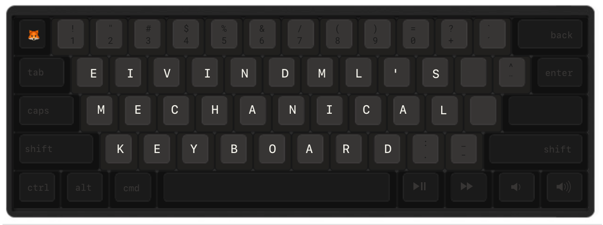

A carpenter cares about the quality of his tools. As a programmer (a person that builds digital stuff), I think it is important to care about the tools I use daily. And the keyboard is the main interface for all the work I do, and I spend a lot of time typing on it. Therefor I wanted to create what I think is the perfect tool for the work I do.

In this repo you will find information and resources related to my build, so you can use them for inspiration or whatever you feel like.

## About

| Part  | Type | Link |
| ------------- | ------------- | ------------- |
| PCB  | Satan GH60 | [Aliexpress](https://www.aliexpress.com/item/Free-shipping-GH60-PCB-KC60-SE-Fully-Programmable-For-DIY-Mechanical-Keyboard-Poker-Faceu-HHKB-Support/32799437588.html?spm=a2g0s.9042311.0.0.MyCpfY)  |
| Plate  | GH60 Black Aluminium Plate | [Aliexpress](https://www.aliexpress.com/item/Mechanical-keyboard-cnc-60-anode-aluminum-drawing-concurrence-positioning-plate-gh60-amj60/32699111693.html?spm=a2g0s.9042311.0.0.MyCpfY)  |
| Case  | 60% Wooden Walnut Case  | [Aliexpress](https://www.aliexpress.com/item/60-Mechanical-Keyboard-Solid-Wood-Case-Poker-Compact-Mini-GH60-Faceu-60-Keyboard-Wooden-Shell-Base/32819168843.html?spm=a2g0s.9042311.0.0.MyCpfY) |
| Switches  | Gateron MX Blue | [Aliexpress](https://www.aliexpress.com/item/Gateron-mx-switch-3-pin-adn-5-pin-transparent-case-mx-green-brown-blue-switches-for/32797603005.html?spm=a2g0s.9042311.0.0.KBDeBn) |
| Stabilizers | Stabilizers for PCB | [Aliexpress](https://www.aliexpress.com/item/4-2x-1-6-25x-1-Sets-Mechanical-Gaming-Keyboard-Cap-Stabilizer-for-PCB-mounted-Keyboards/32759481442.html?spm=a2g0s.9042311.0.0.MyCpfY) |
| Keycaps | 62-Key ISO Custom Cherry MX Keycap Set (see section below) | [wasdkeyboards.com](http://wasdkeyboards.com) |

#### Custom keycaps set

The keycaps are a 62-key custom iso set from wasdkeyboards. Custom sets can be ordered [here](http://www.wasdkeyboards.com/index.php/products/keycap-set/62-key-cherry-mx-keycap-set.html). The keys are set to the darkest gray, and then the modifiers are set to black. The key-layout file is the `layout.ai` file. Feel free to use this diretly or modify it to your needs.

The font used for the keycaps is Apple's **San Fransisco Mono**. Make sure to install that if you wish to use or modify the labels.

## External links

* See [more images on Imgur](https://imgur.com/a/lniT4)
* For questions, you can see [this thread on /r/mechanicalkeyboards](https://www.reddit.com/r/MechanicalKeyboards/comments/73myr9/first_build_photos_of_60_mechanical_keyboard/)

## Licensing

MIT.
